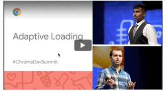

 <div align="center">

  <h1>📺  React Lite YouTube Embed</h1>
  <blockquote>A private by default, faster and cleaner YouTube embed component for React applications</blockquote>

[](https://www.typescriptlang.org/)

[](https://www.npmjs.com/package/react-lite-youtube-embed)&nbsp; &nbsp;&nbsp; &nbsp;&nbsp; &nbsp;&nbsp; &nbsp;[](./LICENSE)&nbsp; &nbsp;  &nbsp;

 
<p>Developed in 🇧🇷 <span role="img" aria-label="Flag for Brazil">Brazil</p>

<strong>Port of Paul Irish's [Lite YouTube Embed](https://github.com/paulirish/lite-youtube-embed) to a React Component. Provide videos with a supercharged focus on visual performance. The gain is not the same as the web component of the original implementation but saves some requests and gives you more control of the embed visual. An ["Adaptive Loading"](https://www.youtube.com/watch?v=puUPpVrIRkc) way to handle iframes for YouTube.</strong>

[](https://main.d1vubvlhfep0xm.amplifyapp.com/)

## [View Demo](https://main.d1vubvlhfep0xm.amplifyapp.com/)

</div>

## 🔒 Up 2.0.0 Privacy by Default

The biggest change is, from 2.0.0 this component is private by default. Meaning that will not preconnect with the ad network from Google and connect to YouTube via the Privacy-Enhanced Mode using https://www.youtube-nocookie.com.

## 🚀 Install

Use your favorite package manager:

```bash
yarn add react-lite-youtube-embed
```

```bash
npm install react-lite-youtube-embed -S
```
## 🕹️ Basic Usage

```javascript
import React from "react";
import { render } from "react-dom";
import LiteYouTubeEmbed from 'react-lite-youtube-embed';
import 'react-lite-youtube-embed/dist/LiteYouTubeEmbed.css'

const App = () => (
  <div>
    <LiteYouTubeEmbed 
        id="L2vS_050c-M"
        title="What’s new in Material Design for the web (Chrome Dev Summit 2019)"
    />
  </div>
);

render(<App />, document.getElementById("root"));
```

And that's it.

## 💎 Pro Usage

```javascript
const App = () => (
  <div>
    <LiteYouTubeEmbed
       id="L2vS_050c-M" // Default none, id of the video or playlist
       adNetwork={true} // Default true, to preconnect or not to doubleclick addresses called by YouTube iframe (the adnetwork from Google)
       params="" // any params you want to pass to the URL, assume we already had '&' and pass your parameters string
       playlist={false} // Use  true when your ID be from a playlist
       playlistCoverId="L2vS_050c-M" // The ids for playlists did not bring the cover in a pattern to render so you'll need pick up a video from the playlist (or in fact, whatever id) and use to render the cover. There's a programmatic way to get the cover from YouTube API v3 but the aim of this component is do not make any another call and reduce requests and bandwidth usage as much as possibe
       poster="hqdefault" // Defines the image size to call on first render as poster image. Possible values are "default","mqdefault",  "hqdefault", "sddefault" and "maxresdefault". Default value for this prop is "hqdefault". Please be aware that "sddefault" and "maxresdefault", high resolution images are not always avaialble for every video. See: https://stackoverflow.com/questions/2068344/how-do-i-get-a-youtube-video-thumbnail-from-the-youtube-api
       title="YouTube Embed" // a11y, always provide a title for iFrames: https://dequeuniversity.com/tips/provide-iframe-titles Help the web be accessible ;)
       noCookie={true} //Default false, connect to YouTube via the Privacy-Enhanced Mode using https://www.youtube-nocookie.com
    />
  </div>
);
```

## 🧰 Bring Your Own Styles

React Lite YouTube Embed comes with all original styles from Paul Irish's [Lite YouTube Embed](https://github.com/paulirish/lite-youtube-embed) but you can customize them as you wish passing as a props.

```javascript
const App = () => (
  <div>
    <LiteYouTubeEmbed
       id="L2vS_050c-M"
       activeClass="lyt-activated" // Default as "lyt-activated", gives control to wrapper once clicked
       iframeClass="" // Default none, gives control to add a class to iframe element itself
       playerClass="lty-playbtn" // Default as "lty-playbtn" to control player button styles
       wrapperClass="yt-lite" // Default as "yt-lite" for the div wrapping the area, the most important class and needs extra attention, please refer to LiteYouTubeEmbed.css for a reference.
    />
  </div>
);
```

## ⚠️ After version 1.0.0 - BREAKING CHANGES ⚠️

To play nice with new frameworks like [NextJS](https://nextjs.org/), we now don't import the `.css` necessary. Since version `2.0.9` you can pass custom aspect-ratio props, so be aware of any changes needed in the CSS options. Instead use now you have three options:

### Option 1

Place the necessary CSS in your Global CSS file method of preference

<details>

<summary> Show me the code!</summary>

```css
.yt-lite {
    background-color: #000;
    position: relative;
    display: block;
    contain: content;
    background-position: center center;
    background-size: cover;
    cursor: pointer;
}

/* gradient */
.yt-lite::before {
    content: '';
    display: block;
    position: absolute;
    top: 0;
    background-image: url(data:image/png;base64,iVBORw0KGgoAAAANSUhEUgAAAAEAAADGCAYAAAAT+OqFAAAAdklEQVQoz42QQQ7AIAgEF/T/D+kbq/RWAlnQyyazA4aoAB4FsBSA/bFjuF1EOL7VbrIrBuusmrt4ZZORfb6ehbWdnRHEIiITaEUKa5EJqUakRSaEYBJSCY2dEstQY7AuxahwXFrvZmWl2rh4JZ07z9dLtesfNj5q0FU3A5ObbwAAAABJRU5ErkJggg==);
    background-position: top;
    background-repeat: repeat-x;
    height: 60px;
    padding-bottom: 50px;
    width: 100%;
    transition: all 0.2s cubic-bezier(0, 0, 0.2, 1);
}

/* responsive iframe with a 16:9 aspect ratio
    thanks https://css-tricks.com/responsive-iframes/
*/
.yt-lite::after {
    content: "";
    display: block;
    padding-bottom: calc(100% / (16 / 9));
}
.yt-lite > iframe {
    width: 100%;
    height: 100%;
    position: absolute;
    top: 0;
    left: 0;
}

/* play button */
.yt-lite > .lty-playbtn {
    width: 70px;
    height: 46px;
    background-color: #212121;
    z-index: 1;
    opacity: 0.8;
    border-radius: 14%; /* TODO: Consider replacing this with YT's actual svg. Eh. */
    transition: all 0.2s cubic-bezier(0, 0, 0.2, 1);
}
.yt-lite:hover > .lty-playbtn {
    background-color: #f00;
    opacity: 1;
}
/* play button triangle */
.yt-lite > .lty-playbtn:before {
    content: '';
    border-style: solid;
    border-width: 11px 0 11px 19px;
    border-color: transparent transparent transparent #fff;
}

.yt-lite > .lty-playbtn,
.yt-lite > .lty-playbtn:before {
    position: absolute;
    top: 50%;
    left: 50%;
    transform: translate3d(-50%, -50%, 0);
}

/* Post-click styles */
.yt-lite.lyt-activated {
    cursor: unset;
}
.yt-lite.lyt-activated::before,
.yt-lite.lyt-activated > .lty-playbtn {
    opacity: 0;
    pointer-events: none;
}
```

For example, for NextJS:

```jsx
<style jsx global>{`
        html,
        body {
          padding: 0;
          margin: 0;
          font-family: -apple-system, BlinkMacSystemFont, Segoe UI, Roboto,
            Oxygen, Ubuntu, Cantarell, Fira Sans, Droid Sans, Helvetica Neue,
            sans-serif;
        }

        * {
          box-sizing: border-box;

        // CSS above

`}</style>

```

</details>

### Option 2

Using your CSS-In-JS tool of choice encapsulate this component and use the css provided as a guide.

### Option 3

Not work on every framework but you can import the css directly, check what works best with your bundler / framework.

<details>
<summary>Show me the code!</summary>

```ts
import 'react-lite-youtube-embed/dist/LiteYouTubeEmbed.css';
```

or in a *.css/scss etc:

```css
@import "~react-lite-youtube-embed/dist/LiteYouTubeEmbed.css";
```

</details>

## All our props belongs to you

The most minimalist implementation requires two props: `id` from the YouTube you want to render and `title`, for the iFrame.

| Prop   |      Type      |  Description |
|----------|:--------:|------------|
| **id** |  string | id of the video or playlist |
| **title** |    string   | Here goes your video title. Always provide a title for iFrames: [https://dequeuniversity.com/tips/provide-iframe-titles](https://dequeuniversity.com/tips/provide-iframe-titles) Help the web be accessible ;) #a11y |
| activeClass | string | Pass the string class for the active state |
| adNetwork | boolean | Default: `false`  To preconnect or not to doubleclick addresses called by YouTube iframe (the adnetwork from Google) |
| announce |    string   | Default: `Watch`. This will added to the button announce to the final user as in `Clickable Watch, ${title}, button` , customize to match your own language #a11y #i18n |
| aspectHeight |    number   | Default: `9`. Use this optional prop if you want a custom aspect-ratio. Please be aware of aspect height and width relation and also any custom CSS you are using. |
| aspectWidth |    number   | Default: `16`. Use this optional prop if you want a custom aspect-ratio. Please be aware of aspect height and width relation and also any custom CSS you are using. |
| cookie | boolean |    Default: `false` Connect to YouTube via the Privacy-Enhanced Mode using [https://www.youtube-nocookie.com](https://www.youtube-nocookie.com). You should opt-in to allow cookies|
| iframeClass | string |    Pass the string class for the own iFrame |
| muted | boolean | If the video has sound or not. Required autoplay `true` to work |
| noCookie | boolean |    `Deprecated` Default `false` _use option **cookie** to opt-in_|
| onIframeAdded | function | Callback that will fired when iframe loads |
| params | string |    any params you want to pass to the URL in the iFrame. Two important points to notice: You need to add the params, we already setup for you, so you should write `start=1150` and not `?start=1150` or `&start=1150`. You can place more params but it will need to fully form: `start=1150&other=value&another=value`. First, when you share a YouTube url the param of time is `t`, but the embed needs `start`.|
| playerClass | string | Pass the string class for the player, once you can customize it |
| playlist | boolean |    Use `true` when your id be from a playlist |
| playlistCoverId | string | The ids for playlists did not bring the cover in a pattern to render so you'll need pick up a video from the playlist (or in fact, whatever id) and use to render the cover. There's a programmatic way to get the cover from YouTube API v3 but the aim of this component is do not make any another call and reduce requests and bandwidth usage as much as possible  |
| poster | string. One of `default` `mqdefault`  `hqdefault` `sddefault` `maxresdefault` |   Defines the image size to call on first render as poster image. See: [https://stackoverflow.com/questions/2068344/how-do-i-get-a-youtube-video-thumbnail-from-the-youtube-api](https://stackoverflow.com/questions/2068344/how-do-i-get-a-youtube-video-thumbnail-from-the-youtube-api) |
| rel | string |   Default `preload`. allows for prefetch or preload of the link url |
| thumbnail | string |   Pass an optional image url to override the default poster and set a custom poster image |
| webp | boolean |   Default `false`. When set, uses the WebP format for poster images |
| wrapperClass | string |   Pass the string class that wraps the iFrame |

## 🙇‍♂️ Thanks

- Paul Irish ([paulirish](https://github.com/paulirish)) for [Lite YouTube Embed](https://github.com/paulirish/lite-youtube-embed)
- Addy Osmani ([addyosmani](https://github.com/addyosmani)) for the Adaptive Loading ideas
- [All contributors](https://github.com/ibrahimcesar/react-lite-youtube-embed/graphs/contributors)

### 📝 Read more

- [Why I made my open source React component private by default](https://ibrahimcesar.cloud/blog/why-i-made-my-open-source-react-component-private-by-default/)

### 🈺 TODO

- [ ] Add tests

## MIT License

Copyright (c) 2020 — 2022 [Ibrahim Cesar](https://ibrahimcesar.cloud)

Permission is hereby granted, free of charge, to any person obtaining a copy
of this software and associated documentation files (the "Software"), to deal
in the Software without restriction, including without limitation the rights
to use, copy, modify, merge, publish, distribute, sublicense, and/or sell
copies of the Software, and to permit persons to whom the Software is
furnished to do so, subject to the following conditions:

The above copyright notice and this permission notice shall be included in all
copies or substantial portions of the Software.

THE SOFTWARE IS PROVIDED "AS IS", WITHOUT WARRANTY OF ANY KIND, EXPRESS OR
IMPLIED, INCLUDING BUT NOT LIMITED TO THE WARRANTIES OF MERCHANTABILITY,
FITNESS FOR A PARTICULAR PURPOSE AND NONINFRINGEMENT. IN NO EVENT SHALL THE
AUTHORS OR COPYRIGHT HOLDERS BE LIABLE FOR ANY CLAIM, DAMAGES OR OTHER
LIABILITY, WHETHER IN AN ACTION OF CONTRACT, TORT OR OTHERWISE, ARISING FROM,
OUT OF OR IN CONNECTION WITH THE SOFTWARE OR THE USE OR OTHER DEALINGS IN THE
SOFTWARE.
